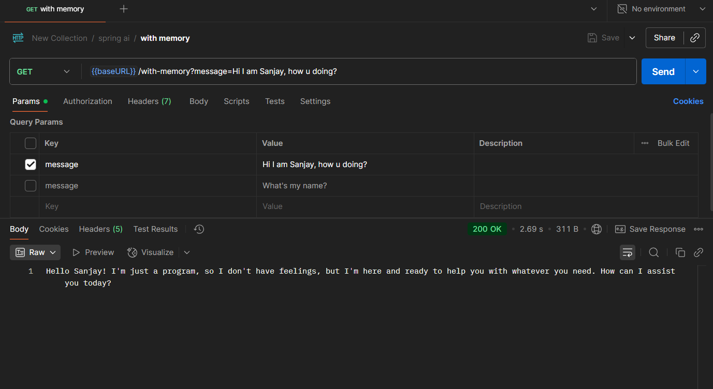
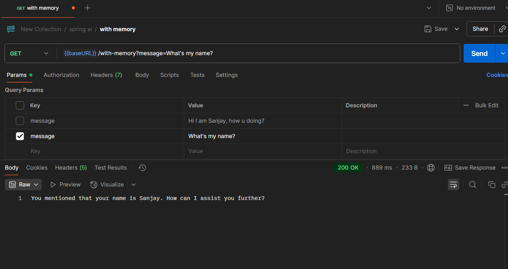

# spring-ai

## About

- Built an intelligent chatbot in Java using Spring AI after completing Dan Vega’s “AI for Java Developers” workshop

- Integrated Retrieval-Augmented Generation (RAG) with a vector database to answer user questions over documents

- Implemented prompt templates, local and cloud LLM support, and multimodal input (text + image) using Spring AI

- Added tool-based AI function calling (MCP), observability with logging, and prompt testing for reliable outputs

## Ouput

